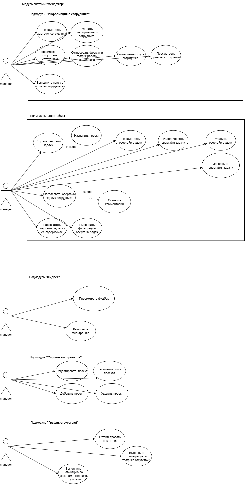
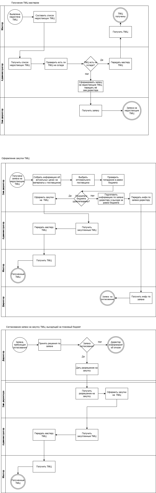
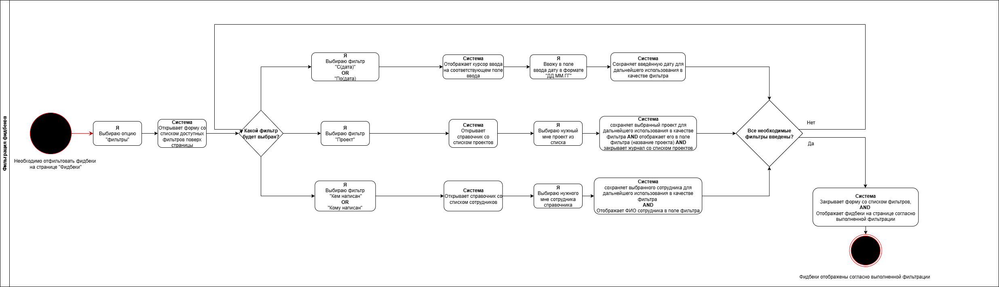
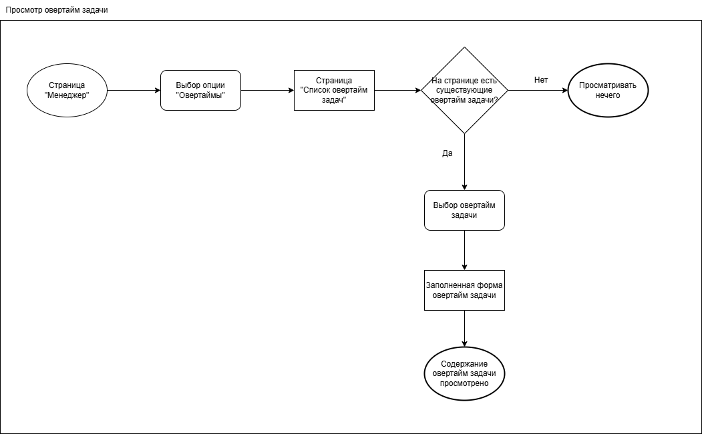
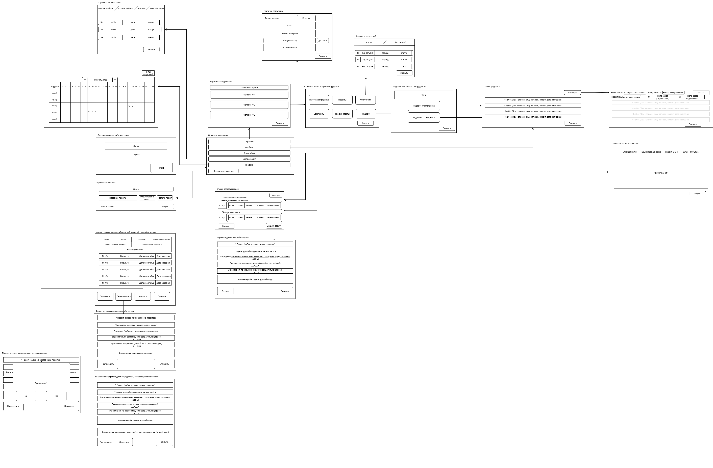

---

### 📄 Документация

| Документ | Описание |
|:---|:---|
| [Vision and Scope](vision-and-scope.md) | Определяет бизнес-контекст, цели, стейкхолдеров, риски и границы решения. |
| [Software Requirements Specification](system-requirements-specification.md) | Содержит полный перечень функциональных и нефункциональных требований, Use Cases, критерии приемки. |

---

### 📊 Диаграммы

#### 1. Use Case Diagram

*Диаграмма вариантов использования модуля «Менеджер»*

**Описание:** Показывает все функции системы с точки зрения акторов:
- **Менеджер** — управление проектами, овертаймами, фидбеками, графиками отсутствий.
- **Сотрудник** — согласование графика, создание овертайм-задач, обмен фидбеками.

**Ключевые сценарии:**
- Управление проектами (CRUD, поиск)
- Управление овертайм-задачами (CRUD, согласование, печать)
- Управление фидбеками (просмотр, фильтрация)
- Управление графиком отсутствий (просмотр, фильтрация, навигация)

---

#### 2. BPMN Diagram — Управление ТМЦ

*Модель бизнес-процесса в нотации BPMN*

**Описание:** Описывает процесс управления кадровыми данными и взаимодействие между участниками (сотрудник, менеджер, система).

**Ключевые процессы:**
- Согласование графика работы
- Согласование отпуска
- Учет овертаймов
- Сбор и обработка фидбеков

---

#### 3. Activity Diagram — Фильтрация фидбеков

*Диаграмма активности для процесса фильтрации фидбеков*

**Описание:** Визуализирует логику выбора критериев фильтрации и применения фильтров к списку фидбеков.

**Ключевые элементы:**
- Выбор фильтра (проект, автор, адресат, дата)
- Применение фильтров
- Отображение отфильтрованного списка

---

#### 4. User Flow — Просмотр овертайм-задачи

*User Flow для сценария просмотра овертайм-задачи менеджером*

**Описание:** Показывает путь пользователя от входа в систему до получения полной информации о задаче.

**Ключевые шаги:**
- Вход в систему
- Переход в раздел «Овертаймы»
- Выбор задачи из списка
- Просмотр деталей задачи

---

#### 5. System Visual Representation

*Нажмите на изображение для открытия в полном размере*

**Описание:** Визуальное представление интерфейса системы. Демонстрирует, как будут выглядеть ключевые страницы модуля «Менеджер».

**Основные экраны:**
- Картотека сотрудников
- Профиль сотрудника
- Список овертайм-задач
- Форма создания овертайм-задачи
- График отсутствий

> ⚠️ **Примечание:** Диаграмма имеет большой размер для сохранения детализации. Для удобства просмотра используйте масштабирование браузера или откройте изображение в новой вкладке.

---

### 🎯 Бизнес-цели проекта

| № | Цель | Целевой показатель |
|:---:|:---|:---|
| 1 | Сократить время согласования рабочего графика | ↓ **20%** |
| 2 | Снизить затраты на выплаты овертаймов | ↓ **5%** |
| 3 | Повысить контроль над планированием отсутствий | ↑ **15%** |
| 4 | Сократить время обработки фидбеков | ↓ **30%** |
| 5 | Сократить время на анализ и составление отчетности | ↓ **50%** |

---

### 🏗️ Ключевые функциональные блоки

| Блок | Описание | Приоритет |
|:---|:---|:---:|
| **Справочник проектов** | Создание, редактирование, удаление, поиск проектов | Must have |
| **Информация о сотруднике** | Просмотр, удаление, поиск, согласование графиков и отпусков | Must have |
| **Овертаймы** | CRUD, согласование, печать, фильтрация овертайм-задач | Must have |
| **Фидбеки** | Просмотр и фильтрация обратной связи | Must have / Should have |
| **График отсутствий** | Просмотр, фильтрация, навигация по месяцам | Must have / Should have |

---

### 👥 Стейкхолдеры

| Роль | Интересы | Опасения |
|:---|:---|:---|
| **Директор** | Повышение эффективности менеджеров, снижение затрат на ручной учет | Неокупаемые инвестиции в проект |
| **Старший менеджер** | Наблюдение за загрузкой команд, принятие решений на основе данных | Сложность освоения новой системы |
| **Менеджер отдела** | Автоматический учет овертаймов, мониторинг загрузки команды, анализ фидбеков | Риск сокращения из-за автоматизации |
| **Сотрудник** | Простое согласование графика, гарантия учета овертаймов, удобный обмен фидбеками | Усиление контроля, сложность интерфейса |

---

### 📅 План релизов

Разработка модуля разбита на 4 этапа:

**🚀 Релиз 1** — *T+2 недели*  
**MVP:** просмотр фидбеков, карточка сотрудника, CRUD овертаймов, создание проектов, график отсутствий

---

**🔄 Релиз 2** — *T+4 недели*  
Согласование графиков/отпусков, утверждение овертаймов, редактирование проектов

---

**📈 Релиз 3** — *T+6 недель*  
Поиск сотрудников, удаление овертаймов, управление проектами, навигация в графике

---

**🖨 Релиз 4** — *T+8 недель*  
Печать овертайм-задач

---

### 🛠️ Технологический контекст

| Элемент | Технология |
|:---|:---|
| **Платформа** | Веб-приложение |
| **Браузеры** | Google Chrome, Microsoft Edge (версии не ниже 140.0) |
| **База данных** | Oracle |
| **Язык разработки** | Java 25.0 |

---

### 📝 Примечания

- Документы и диаграммы выполнены в рамках учебного курса IT-Academy.
- Все артефакты отражают реальные бизнес-задачи и могут быть адаптированы для коммерческого использования.
- Имена файлов диаграмм соответствуют их содержанию для удобства навигации.

---

[⬅️ Вернуться к главному README](../README.md)
