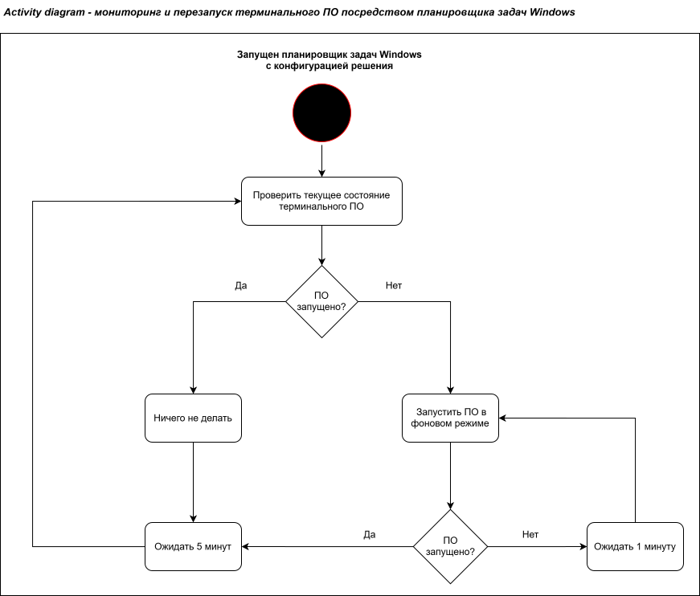

# Решение проблемы клиента: автоматический перезапуск терминального ПО

**Контекст:** работая в отделе сопровождения, столкнулся с повторяющейся проблемой у конкретного клиента в сути представляющей собой самопроизвольное прекращение работы ПО, отвечавшего за работу банковского терминала и его связь с компьютером. Наш партнёр-вендор данного ПО не спешил на неё реагировать, поэтому я решил самостоятельно попытаться придумать хотя бы временное решение, которое могло бы как-то положительно повлиять на его работу и сократить количество подобных обращений и время простоя банковского терминала.

**В ходе анализа были выявлены возможные причины возниконвения проблемы:** 
- кассир мог случайно закрывать программу в том случае, если процесс по какой-либо причине запускался не в фоне, а в виде консольного приложения;
- средства Windows могли принудительно завершать процесс;
- текущая кофигурация Windows являлась неблагоприятной для действия данного ПО, из-за чего оно могло бы периодически самостоятельно завершать свою работу (ошибки, краши)

**Одним из самых доступных и действенных решений я выделил** настройку планировщика задач Windows, который проверяет статус процесса каждые 5 минут и автоматически перезапускает программу в фоновом режиме в случае сбоя. Это исключило возможность случайного закрытия кассиром и свело к минимуму влияние системных сбоев. Сама же ошибка как проблема работы ПО стороннего вендора была передана им в обработку.

**Спустя неделю при анализе влияния решения было выделено следующее:**
- количество обращений по проблеме сократилось с 3–5 до 0–1 в неделю;
- простои терминала снизились с 15–30 минут до 0–2 минут в день;
- клиент перестал терять время на ожидание и повторные звонки в поддержку.

**Логика работы решения:**

**Выполненные работы:**
- проанализированы возможные причины сбоя;
- выявлены косвенные признаки (человеческий фактор, средства Windows);
- предложено и реализовано решение без изменения кода стороннего продукта;
- проанализировано влияние решения спустя определённое время после его внедрения.
  
Как **итог** можно отметить положительное воздействие внедрённого решения, приведшего к сокращению количества обращений с подобной проблемой практически до нуля. Я не исправил код вендора, но устранил проблему на уровне ОС, которую никто до меня не решал, а просто перезапускал программу руками, оставляя её так же не в фоновом режиме, а в виде консоли, поддверженной влиянию неопытного пользователя.
Решение сделано за полчаса, не требует денежных вложений и работает до сих пор, пока проблему не решили разработчики приложения на уровне работы самого приложения.

---

[⬅️ Назад к портфолио](../README.md)
